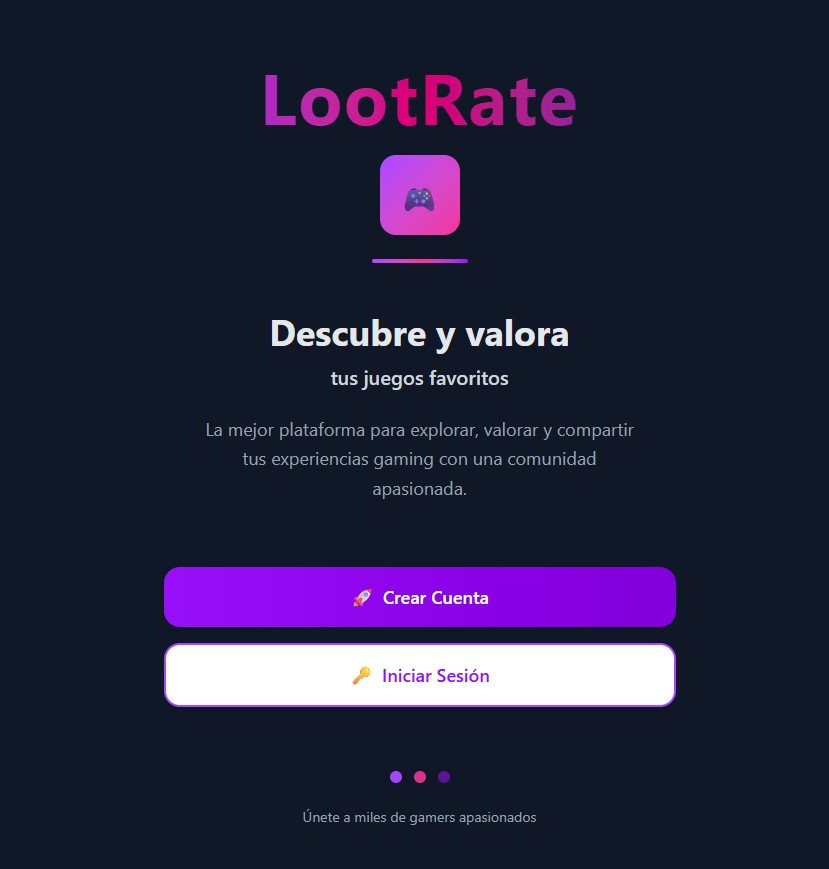
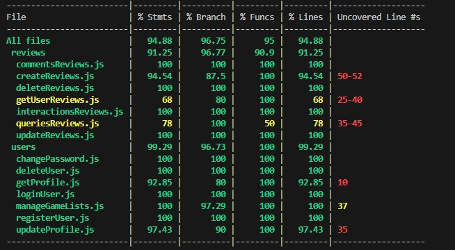

# LOOTRATE

## Description

LootRate is a full-stack gaming platform that allows users to discover, review, and rate video games. Users can search for games, write detailed reviews, score games from 1-5, create personalized game lists, and interact with other gamers' reviews through likes and comments. The platform integrates with the RAWG API to provide comprehensive game data and creates a community-driven gaming experience.

## Functional Description

### Core Features
- User authentication and profile management
- Game search and discovery
- Review and rating system
- Game list management (favorites, wishlist, completed)
- Comment system on reviews
- Like/dislike interactions
- Genre and platform filtering
- Responsive design

### Use Cases
- User registration and login
- Profile creation and management
- Password change functionality
- Account deletion
- Game search and browsing
- Writing and editing game reviews
- Rating games (1-10 scale)
- Creating and managing game lists
- Commenting on reviews
- Liking/disliking reviews
- Viewing rankings by genre
- Discovering games by platform

## UI/UX Design
https://www.figma.com/design/QmtEii1I54MdI6MtCemmrz/LootRate?node-id=0-1&p=f&t=xyzXPFLiN3K0xD72-0

## Technical Description

### Technologies & Libraries

#### Frontend
- React 19.1.0
- Vite 6.3.5
- Tailwind CSS 4.1.8
- React Router DOM 7.6.0
- Redux & React-Redux
- Axios
- JWT Decode
- Bootstrap Icons
- Styled Components

#### Backend
- Node.js
- Express 5.1.0
- MongoDB & Mongoose 8.15.1
- JWT (jsonwebtoken)
- Bcrypt.js
- Axios (for RAWG API)
- CORS
- Dotenv

#### Testing & Development
- Mocha & Chai
- C8 (Code Coverage)
- ESLint
- Esmock

#### External APIs
- **RAWG Video Games Database API**
- **MongoDB Atlas**

## API Endpoints

### Authentication
- POST   /api/users/           - Register new user
- POST   /api/users/auth       - User login

### User Profile
- GET    /api/users/profile/own              - Get own profile
- GET    /api/users/profile/user/:username   - Get user profile by username
- PUT    /api/users/profile                  - Update profile
- PUT    /api/users/change-password          - Change password
- DELETE /api/users/account                  - Delete account

### Game Lists
- POST   /api/users/lists/add                     - Add game to list
- DELETE /api/users/lists/remove                  - Remove game from list
- GET    /api/users/lists/own/:listType           - Get own game list
- GET    /api/users/lists/user/:username/:listType - Get user's game list

### Games
- GET    /api/games/home                    - Get home page data
- GET    /api/games/genre/:genreSlug        - Get games by genre
- GET    /api/games/platform/:platformSlug  - Get games by platform
- GET    /api/games/search                  - Search games
- GET    /api/games/:gameId                 - Get game details
- GET    /api/games/:gameId/stores          - Get game stores
- GET    /api/games/genres                  - Get all genres
- GET    /api/games/platforms               - Get all platforms

### Reviews
- POST   /api/reviews/                    - Create review
- GET    /api/reviews/user/:userId        - Get user reviews
- GET    /api/reviews/game/:gameId        - Get game reviews
- PUT    /api/reviews/:reviewId           - Update review
- DELETE /api/reviews/:reviewId          - Delete review
- POST   /api/reviews/:reviewId/like      - Toggle like on review

### Comments
- POST   /api/reviews/:reviewId/comments           - Add comment to review
- GET    /api/reviews/:reviewId/comments           - Get review comments
- PUT    /api/reviews/:reviewId/comments/:commentId - Update comment
- DELETE /api/reviews/:reviewId/comments/:commentId - Delete comment

## Data Models

### User Schema
{
  _id: ObjectId,
  username: String (unique),
  email: String (unique),
  password: String (hashed),
  avatar: String (optional),
  createdAt: Date,
  updatedAt: Date
}

### Game Schema
{
  _id: ObjectId,
  rawgId: Number, // ID from RAWG API
  name: String,
  platforms: [String], // ['PC', 'PlayStation', 'Xbox', 'Switch']
  genres: [String],
  releaseDate: Date,
  apiScore: Number,
  userScores: [{
    user: ObjectId,
    score: Number (1-10)
  }],
  averageUserScore: Number,
  imageUrl: String
}

### Review Schema
{
  _id: ObjectId,
  author: ObjectId,
  game: ObjectId,
  content: String,
  score: Number (1-10),
  likes: [ObjectId], // Array of user IDs who liked
  comments: [{
    author: ObjectId,
    content: String,
    createdAt: Date
  }],
  createdAt: Date,
  updatedAt: Date
}

### Test Coverage

## Project

https://lootrate.surge.sh/
